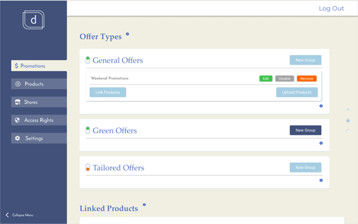
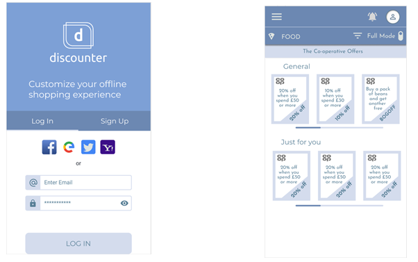

## University of Northampton Dissertation - 2020
The contents of this repository are part of work done for my 2020 dissertation. The project is a three part web 
application with a dedicated api, back-end and front-end. 

The aim of this project is to give retailers the ability to automatically generate
promotions for their products, and connect in real-time with their consumer base through a web application. The users, through this web application can then receive promotions which at first are general, but
during time the application learns about them and it generates promotions which are more tailored.

All three parts have been developed using the GRAND stack (GraphQL, Apollo, ReactJS and Neo4j Database). The api has
been created using Apollo and Graphql, and it connects to a Neo4j server deployed with Microsoft Azure. The front-ends
for both the users and the retailers are done in ReactJS, and the user interface is developed using a mobile first approach
and it can easily be turned into a progressive web app to have access to more device features for learning about the users.

## Quick installation - for evaluation
Running this repo requires nodejs to be installed (repo tested with nodejs 12.18.2, do not use latest version 14 as file upload will not work). The following steps will help set up and run the development environment of all three parts:
- Clone the repo using: ```git clone https://github.com/NIfrim/Dissertation2020```
- Open cloned directory with your preferred IDE
- Run ```npm install``` within each sub-directories (api, retailers, and users)
- Run ```npm run dev``` from three different terminals within each of the sub-directories (api, retailers, and users). Might be asked to confirm use of different port, this is ok
- Each terminal should display the relevant port on which they run from localhost, use these to connect to each service

## UI retailers & users
Retailers use the interface to manage the promotions and related products:


Users (Clients) use the interface to manage their accounts and use promotions:

